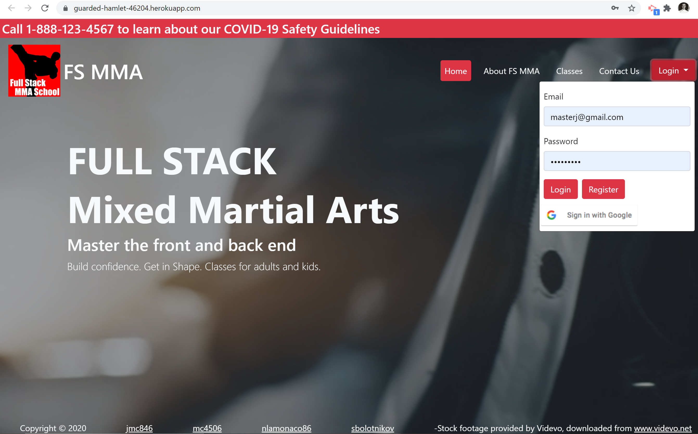
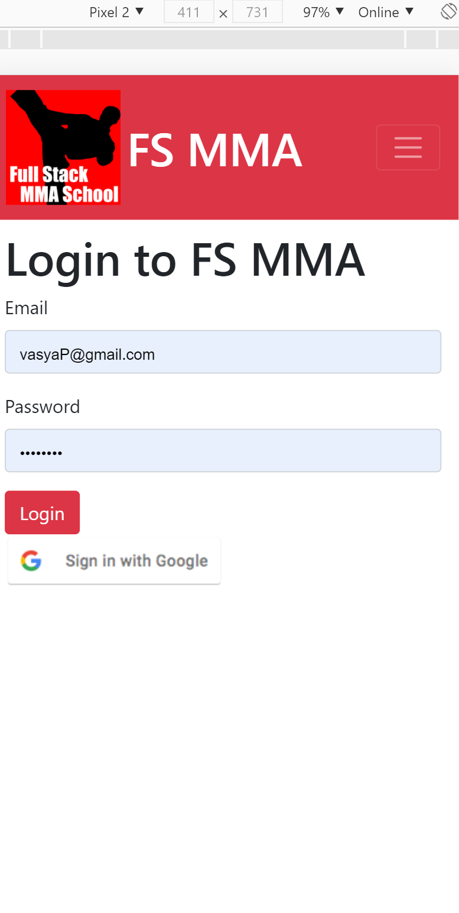
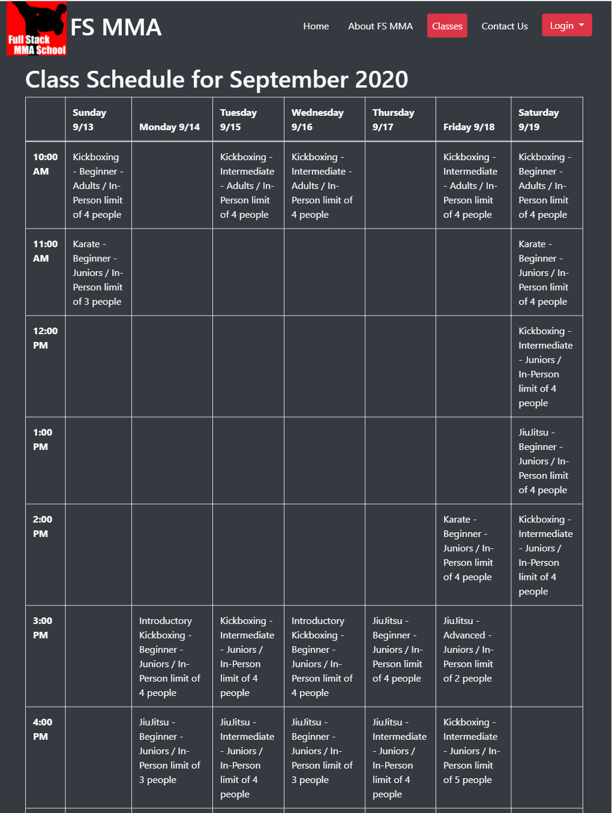
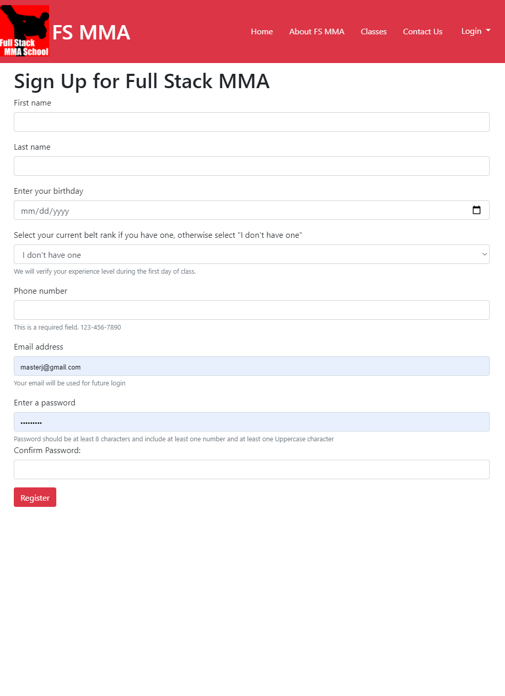
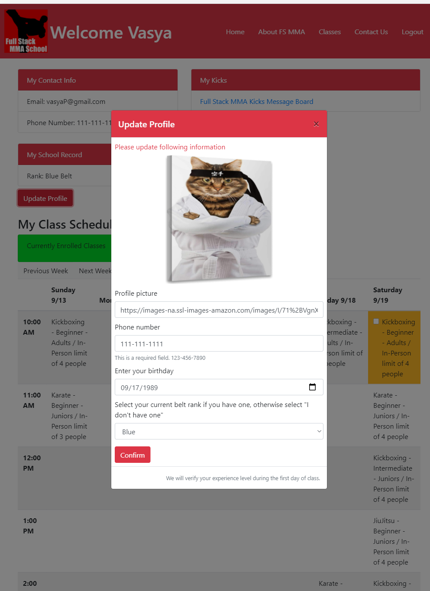
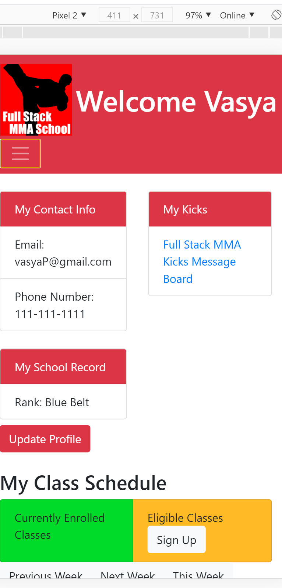
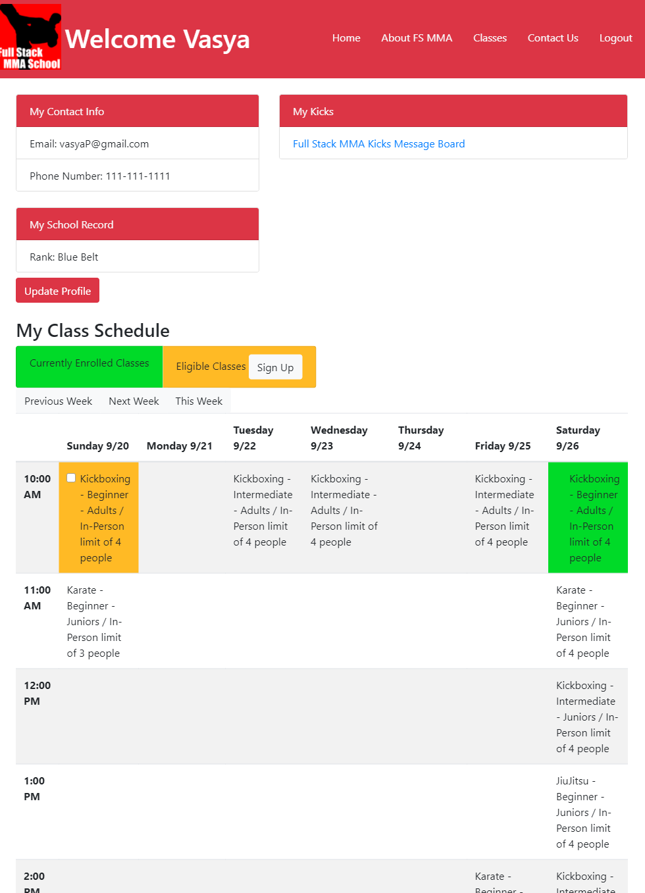
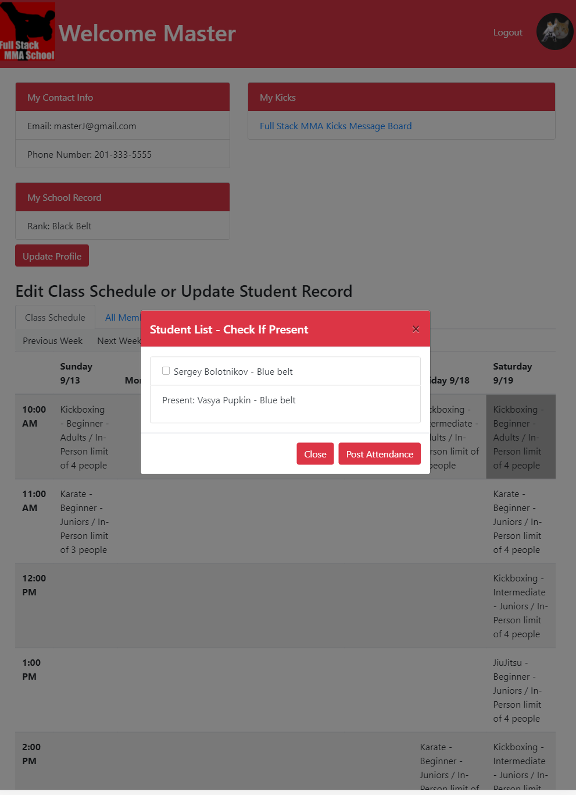
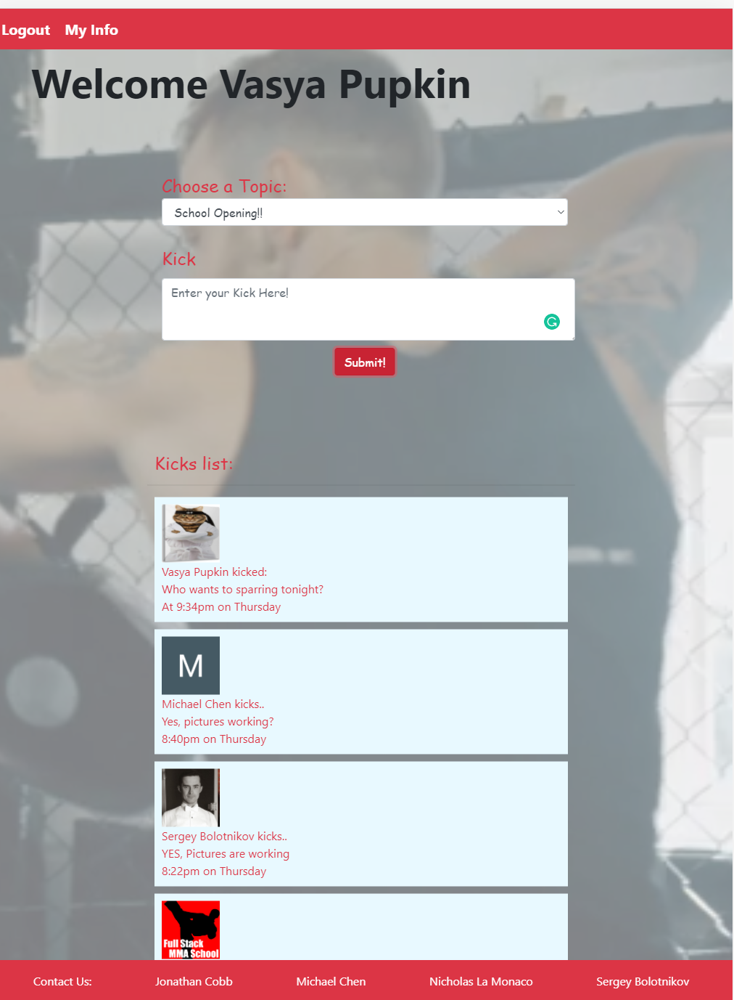

# Full Stack MMA School  

## Description

Full Stack MMA School is an application for creating and managing classes for a martial arts school. Instructors are able to log in and create classes based on user skill level and preference for in-person or virtual lessons, and coordinate class size if constraints are required by local health ordinances. Students and instructors can also post messages and communicate with each other through the platform.

Our application uses Node.js, Express, mySQL, Sequelize, JQuery, Passport, Passport-local, Passport-google-oauth, and Bootstrap.

Deployed Site:  https://guarded-hamlet-46204.herokuapp.com/

## Table of Contents

* [Installation](#installation)
* [Usage](#usage)
* [Contributing](#contributing)
* [License](#license)
* [Questions](#questions)

## Installation

Just clone this Repo. Visit the deployed page [link](https://guarded-hamlet-46204.herokuapp.com/).

## Usage

### Front page on desktop

### Login in mobile. there is a Google sign in option.

### Without sign in people can see groups schedule 

### Registration page 

### Student Profile

### Mobile student profile

### Signing to class as student

### Teacher's Profile check who is present

### Special Studio Chat named KICKS

## Contributing 
 * Jonathan Cobb [jmc846](https://github.com/jmc846)
 * Michael Chen  [mc4506](https://github.com/mc4506)
 * Nicholas La Monaco [nlamonaco86](https://github.com/nlamonaco86)
 * Sergey Bolotnikov  [sbolotnikov](https://github.com/sbolotnikov) 
## License 
 Licensed under MIT License. 
## Tests 
 None

## Questions

Mail us: 
 * Jonathan Cobb [jmc846](mailto:jmc846@scarletmail.rutgers.gmail.com)
 * Michael Chen [mc4506](mailto:mike4506@gmail.com)
 * Nicholas La Monaco [nlamonaco86](mailto:nlamonaco86@gmail.com)
 * Sergey Bolotnikov [sbolotnikov](mailto:sbolotnikov@gmail.com)
